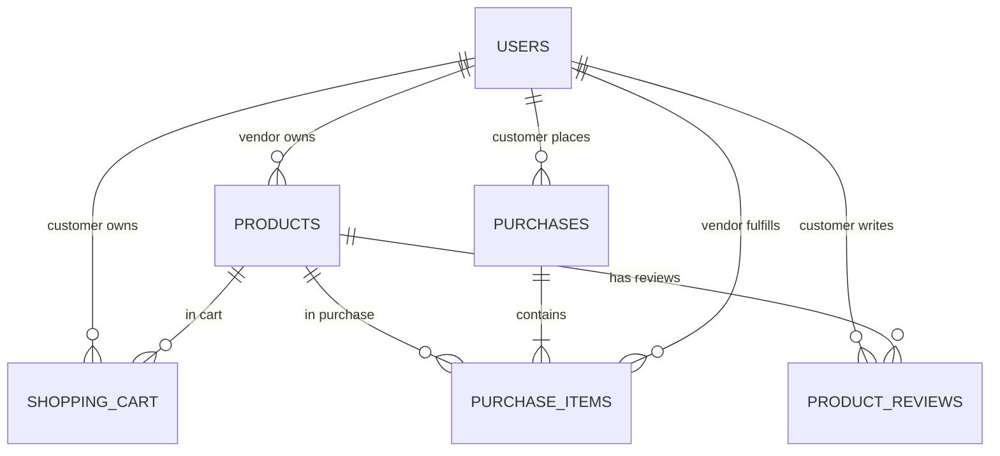

# Rahul Mart Multi-Vendor Marketplace

Rahul Mart is a complete, runnable, database-backed multi-vendor e-commerce capstone application built with **Java 17**, **Java Servlets (javax.servlet / Tomcat 9)**, **JDBC with HikariCP**, **H2 Database**, **Maven**, and a responsive **Vanilla HTML5/CSS3/JavaScript** frontend.

---

## 1. Project Purpose & Highlights
- **Multi-Vendor Ecosystem**: Supports **Customer**, **Vendor**, and **Administrator** roles with distinct capabilities and security policies.
- **Server-Enforced Business Logic**: All validation, authorization, price calculations, inventory management, and checkout transactions execute strictly on the server.
- **ACID Transactional Checkout**: Checkout executes within a single JDBC transaction with atomic inventory reduction, price recalculation, and cart clearance.
- **Verified Product Reviews**: Customers can review products only after they own a `DELIVERED` order containing that product.
- **AI Shopping Assistant**: Integrated chatbot powered by `MockChatProvider` (default) with optional `GeminiChatProvider` integration.

---

## 2. Technology Stack

| Layer | Technology |
|---|---|
| **Language** | Java 17 |
| **Web Container** | Apache Tomcat 9 (`javax.servlet-api:4.0.1`) |
| **Build & Dependency Management** | Maven (WAR packaging) |
| **Database** | H2 Database (File-based DB `~/zenithbazaar_db` / In-Memory for testing) |
| **Connection Pool** | HikariCP 5.1.0 |
| **Security & Hashing** | jBCrypt 0.4 (BCrypt password hashing) |
| **JSON Parser** | Gson 2.10.1 |
| **Logging** | SLF4J 2.0.9 + Logback 1.4.11 |
| **Testing** | JUnit 5 + Mockito 5 |
| **Frontend** | HTML5, CSS3 (Vanilla CSS variables), Vanilla JavaScript (Fetch API) |

---

## 3. Architecture & Data Flow

```
Browser (Vanilla HTML/CSS/JS)
       ↓
Filter & Security Layer (AuthenticationFilter, CorsFilter, CharacterEncodingFilter)
       ↓
Servlet Controller Layer (AccountServlet, CatalogServlet, BasketServlet, PurchaseServlet, ReviewServlet, VendorServlet, AdminServlet, SystemHealthServlet, ChatServlet)
       ↓
Service Layer (UserService, ProductService, CartService, OrderService, ReviewService, ChatbotService)
       ↓
DAO / Repository Layer (UserDao, ProductDao, CartDao, OrderDao, ReviewDao)
       ↓
Database Access (HikariCP DataSource -> H2 Database)
```

---

## 4. Relational Database Schema & ER Diagram

The normalized relational database consists of 6 tables:

- `users`: User accounts (`CUSTOMER`, `VENDOR`, `ADMINISTRATOR`).
- `products`: Product catalog linked to vendors (`vendor_id`).
- `shopping_cart`: Persistent customer cart items.
- `purchases`: Master purchase orders with order number, status, and total amount (`DECIMAL(10,2)`).
- `purchase_items`: Individual items within an order referencing product, vendor, unit price, and subtotal.
- `product_reviews`: Verified customer ratings (1–5) and comments.



---

## 5. Pre-seeded Demo Accounts

> [!WARNING]
> **Demo Password Notice**: All pre-seeded demo accounts use the password `Demo1234!`. In a production environment, change these credentials immediately.

| Role | Email | Password | Details |
|---|---|---|---|
| **Administrator** | `admin@zenithbazaar.com` | `Demo1234!` | Pre-seeded admin account (Self-registration is disallowed) |
| **Vendor 1** | `vendor1@techstore.com` | `Demo1234!` | Apex Tech Solutions (Electronics Vendor) |
| **Vendor 2** | `vendor2@fashionhub.com` | `Demo1234!` | Urban Vogue Outfitters (Fashion & Home Vendor) |
| **Customer 1** | `customer1@gmail.com` | `Demo1234!` | Alice Smith (Has a pre-seeded `DELIVERED` order & review) |
| **Customer 2** | `customer2@yahoo.com` | `Demo1234!` | Bob Johnson |
| **Customer 3** | `customer3@outlook.com` | `Demo1234!` | Charlie Brown |

---

## 6. Comprehensive REST API Endpoints

| Method | Endpoint | Access Role | Description |
|---|---|---|---|
| `POST` | `/api/account/register` | Public | Register a new `CUSTOMER` or `VENDOR` |
| `POST` | `/api/account/login` | Public | Authenticate user and create HTTP Session |
| `POST` | `/api/account/logout` | Authenticated | Invalidate current session |
| `GET` | `/api/account/me` | Authenticated | Fetch current user session profile |
| `GET` | `/api/catalog/products` | Public | Search/filter active products with pagination |
| `GET` | `/api/catalog/products/{id}` | Public | Detailed product view with ratings & reviews |
| `GET` | `/api/catalog/categories` | Public | Distinct product categories list |
| `GET` | `/api/basket` | Customer | Fetch current customer shopping cart summary |
| `POST` | `/api/basket/items` | Customer | Add product to cart with server stock check |
| `PUT` | `/api/basket/items/{productId}`| Customer | Set cart item quantity |
| `DELETE`| `/api/basket/items/{productId}`| Customer | Remove item from cart |
| `DELETE`| `/api/basket` | Customer | Clear shopping cart |
| `POST` | `/api/purchases/checkout` | Customer | Execute ACID checkout transaction |
| `GET` | `/api/purchases` | Customer | Customer order history |
| `GET` | `/api/purchases/{id}` | Customer/Vendor/Admin | Detailed order view (authorized by role) |
| `POST` | `/api/reviews` | Customer | Create review (enforces `DELIVERED` purchase check) |
| `GET` | `/api/reviews/product/{id}` | Public | List reviews for a product |
| `GET` | `/api/vendor/products` | Vendor | List vendor's own products |
| `POST` | `/api/vendor/products` | Vendor | Create new vendor product |
| `PUT` | `/api/vendor/products/{id}` | Vendor | Edit vendor product (ownership checked) |
| `DELETE`| `/api/vendor/products/{id}`| Vendor | Deactivate vendor product |
| `GET` | `/api/vendor/orders` | Vendor | Orders containing vendor's products |
| `GET` | `/api/administrator/users` | Admin | List all system users |
| `PUT` | `/api/administrator/users/{id}/status` | Admin | Activate/deactivate user |
| `GET` | `/api/administrator/products` | Admin | List all global products |
| `PUT` | `/api/administrator/products/{id}/status` | Admin | Activate/deactivate product |
| `GET` | `/api/administrator/orders` | Admin | List all system purchases |
| `PUT` | `/api/administrator/orders/{id}/status` | Admin | Update order status (`DELIVERED`, `SHIPPED`, etc.) |
| `GET` | `/api/system/health` | Public | Health check verifying H2 database connectivity |
| `POST` | `/api/chat` | Public | AI Chatbot assistant query endpoint |

---

## 7. Installation & Deployment Guide

### Prerequisites
- JDK 17 installed and set as `JAVA_HOME`.
- Apache Maven 3.8+ installed.
- Apache Tomcat 9.0+ installed.

### Step 1: Clone & Compile
```bash
git clone https://github.com/example/zenith-bazaar.git
cd capstone1

# Run unit & integration test suite
mvn clean test

# Package WAR file
mvn clean package
```
The compiled WAR artifact will be generated at `target/zenith-bazaar.war`.

### Step 2: Tomcat 9 Deployment
1. Copy `target/zenith-bazaar.war` into Tomcat's `webapps/` directory.
2. Start Tomcat server:
   - **Windows**: `bin\startup.bat`
   - **Linux/Mac**: `bin/startup.sh`
3. Access the application in browser:
   `http://localhost:8080/zenith-bazaar/`

### Step 3: Database Auto-Initialization
On Tomcat startup, `AppContextListener` initializes HikariCP and executes `DatabaseInitializer`, automatically creating database tables and seeding initial demo data into the H2 database (`./zenithbazaar_db`).

---

## 8. Chatbot Assistant Configuration

The chatbot provider can be toggled via `src/main/resources/application.properties`:

```properties
# Default Mock Provider (No external API key needed)
chat.provider=mock

# Gemini AI Provider Configuration (Optional)
# chat.provider=gemini
# chat.gemini.api.key=YOUR_GEMINI_API_KEY
# chat.gemini.model=gemini-1.5-flash
```

---

## 9. Verification & End-to-End Workflow

1. **Health Verification**:
   Navigate to `http://localhost:8080/zenith-bazaar/api/system/health`
   Expected response: `{"success": true, "data": {"status": "UP", "database": "UP"}}`.

2. **Customer Flow**:
   - Login as `customer1@gmail.com` / `Demo1234!`.
   - Browse catalog, filter by category or search.
   - Add product to cart, view cart subtotal, proceed to checkout.
   - Complete checkout: verifies inventory reduction & transaction success.
   - View order in "My Orders".
   - Submit product review for `DELIVERED` items.

3. **Vendor Flow**:
   - Login as `vendor1@techstore.com` / `Demo1234!`.
   - Access "Vendor Portal".
   - Create a new product or edit existing product stock/price.
   - View incoming customer orders containing Vendor 1 items.

4. **Administrator Flow**:
   - Login as `admin@zenithbazaar.com` / `Demo1234!`.
   - Access "Admin Dashboard".
   - Manage user active states, activate/deactivate products.
   - View system orders and update order status to `DELIVERED`.

---

## 10. Screenshots & UI Previews

*(Place screenshots of Index Catalogue, Vendor Portal, Admin Dashboard, Cart, and Chatbot in this section when documenting UI demonstrations).*
