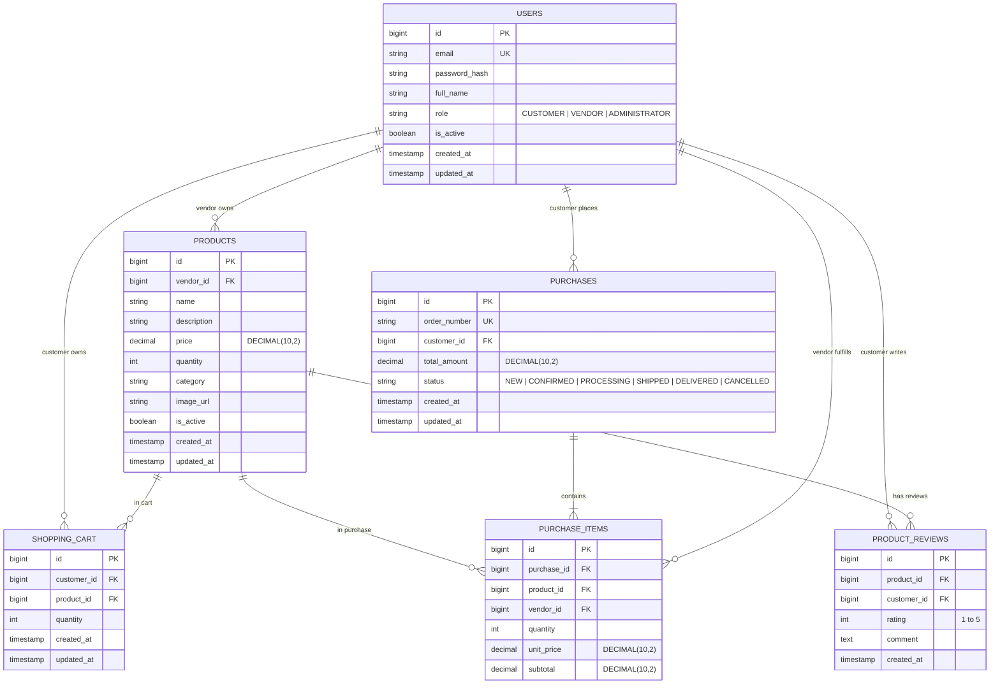

# ZenithBazaar - Entity Relationship (ER) Diagram

## Relational Constraints & Integrity
1. **Primary Keys**: Every entity uses synthetic auto-incrementing `BIGINT` primary keys (`id`).
2. **Foreign Keys**: Enforces parent-child relationships (`ON DELETE RESTRICT` semantics to protect historical order data).
3. **Unique Constraints**:
   - `users.email`: Unique email per user account.
   - `purchases.order_number`: Unique business tracking code for orders.
   - `shopping_cart(customer_id, product_id)`: Prevents duplicate rows for the same product in a customer's cart.
   - `product_reviews(product_id, customer_id)`: Server-enforced unique constraint preventing duplicate customer reviews per product.
4. **Monetary Values**: All price, subtotal, and total fields use `DECIMAL(10,2)` to prevent floating point rounding inaccuracies.
