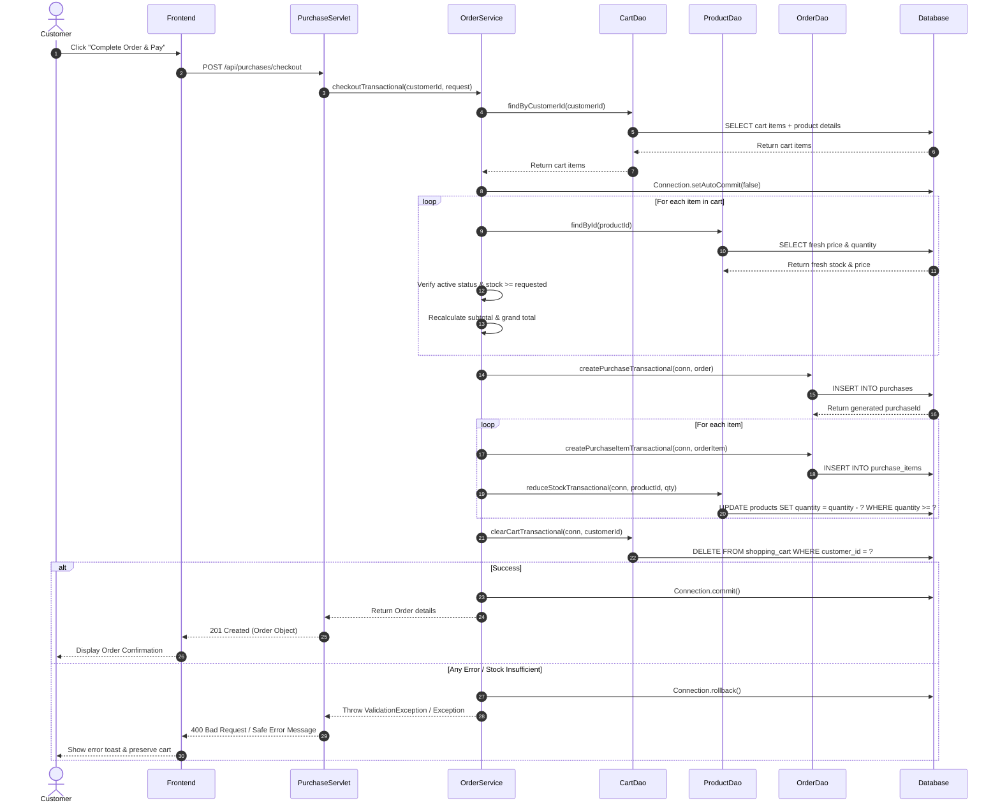
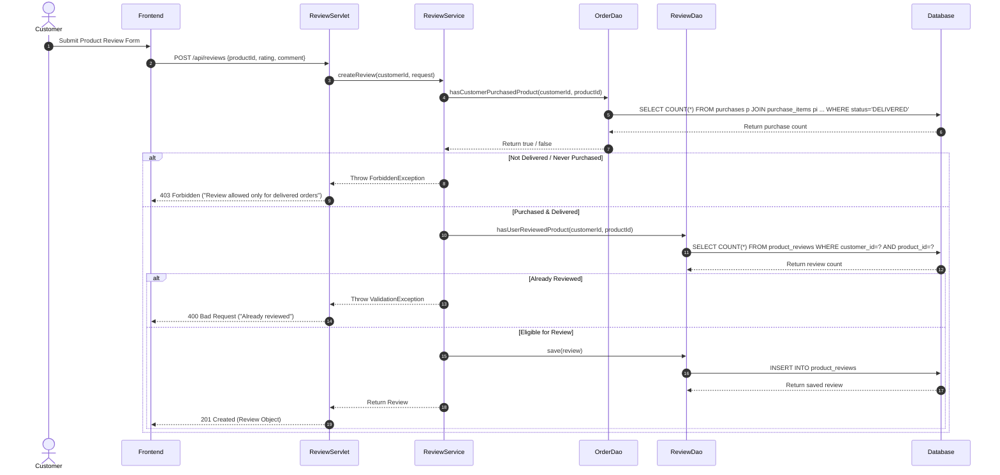

# ZenithBazaar - Sequence Diagrams

## 1. Transactional Checkout Sequence (ACID JDBC Transaction)

```mermaid
sequenceDiagram
    autonumber
    actor Customer
    participant Frontend
    participant PurchaseServlet
    participant OrderService
    participant CartDao
    participant ProductDao
    participant OrderDao
    participant Database

    Customer->>Frontend: Click "Complete Order & Pay"
    Frontend->>PurchaseServlet: POST /api/purchases/checkout
    PurchaseServlet->>OrderService: checkoutTransactional(customerId, request)
    OrderService->>CartDao: findByCustomerId(customerId)
    CartDao->>Database: SELECT cart items + product details
    Database-->>CartDao: Return cart items
    CartDao-->>OrderService: Return cart items

    OrderService->>Database: Connection.setAutoCommit(false)
    
    loop For each item in cart
        OrderService->>ProductDao: findById(productId)
        ProductDao->>Database: SELECT fresh price & quantity
        Database-->>ProductDao: Return fresh stock & price
        OrderService->>OrderService: Verify active status & stock >= requested
        OrderService->>OrderService: Recalculate subtotal & grand total
    end

    OrderService->>OrderDao: createPurchaseTransactional(conn, order)
    OrderDao->>Database: INSERT INTO purchases
    Database-->>OrderDao: Return generated purchaseId

    loop For each item
        OrderService->>OrderDao: createPurchaseItemTransactional(conn, orderItem)
        OrderDao->>Database: INSERT INTO purchase_items
        OrderService->>ProductDao: reduceStockTransactional(conn, productId, qty)
        ProductDao->>Database: UPDATE products SET quantity = quantity - ? WHERE quantity >= ?
    end

    OrderService->>CartDao: clearCartTransactional(conn, customerId)
    CartDao->>Database: DELETE FROM shopping_cart WHERE customer_id = ?

    alt Success
        OrderService->>Database: Connection.commit()
        OrderService-->>PurchaseServlet: Return Order details
        PurchaseServlet-->>Frontend: 201 Created (Order Object)
        Frontend-->>Customer: Display Order Confirmation
    else Any Error / Stock Insufficient
        OrderService->>Database: Connection.rollback()
        OrderService-->>PurchaseServlet: Throw ValidationException / Exception
        PurchaseServlet-->>Frontend: 400 Bad Request / Safe Error Message
        Frontend-->>Customer: Show error toast & preserve cart
    end
```

## 2. Server-Enforced Product Review Sequence

```mermaid
sequenceDiagram
    autonumber
    actor Customer
    participant Frontend
    participant ReviewServlet
    participant ReviewService
    participant OrderDao
    participant ReviewDao
    participant Database

    Customer->>Frontend: Submit Product Review Form
    Frontend->>ReviewServlet: POST /api/reviews {productId, rating, comment}
    ReviewServlet->>ReviewService: createReview(customerId, request)
    
    ReviewService->>OrderDao: hasCustomerPurchasedProduct(customerId, productId)
    OrderDao->>Database: SELECT COUNT(*) FROM purchases p JOIN purchase_items pi ... WHERE status='DELIVERED'
    Database-->>OrderDao: Return purchase count
    OrderDao-->>ReviewService: Return true / false

    alt Not Delivered / Never Purchased
        ReviewService-->>ReviewServlet: Throw ForbiddenException
        ReviewServlet-->>Frontend: 403 Forbidden ("Review allowed only for delivered orders")
    else Purchased & Delivered
        ReviewService->>ReviewDao: hasUserReviewedProduct(customerId, productId)
        ReviewDao->>Database: SELECT COUNT(*) FROM product_reviews WHERE customer_id=? AND product_id=?
        Database-->>ReviewDao: Return review count
        
        alt Already Reviewed
            ReviewService-->>ReviewServlet: Throw ValidationException
            ReviewServlet-->>Frontend: 400 Bad Request ("Already reviewed")
        else Eligible for Review
            ReviewService->>ReviewDao: save(review)
            ReviewDao->>Database: INSERT INTO product_reviews
            Database-->>ReviewDao: Return saved review
            ReviewService-->>ReviewServlet: Return Review
            ReviewServlet-->>Frontend: 201 Created (Review Object)
        end
    end
```
