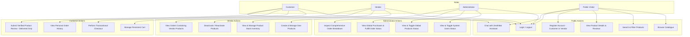

# ZenithBazaar - Use-Case Diagram

```mermaid
graph TD
    subgraph Roles
        C[Customer]
        V[Vendor]
        A[Administrator]
        P[Public Visitor]
    end

    subgraph Public Actions
        UC1[Browse Catalogue]
        UC2[Search & Filter Products]
        UC3[View Product Details & Reviews]
        UC4[Register Account - Customer or Vendor]
        UC5[Login / Logout]
        UC6[Chat with ZenithBot Assistant]
    end

    subgraph Customer Actions
        UC7[Manage Persistent Cart]
        UC8[Perform Transactional Checkout]
        UC9[View Personal Order History]
        UC10[Submit Verified Product Review - Delivered Only]
    end

    subgraph Vendor Actions
        UC11[Create & Manage Own Products]
        UC12[View & Manage Product Stock Inventory]
        UC13[Deactivate / Reactivate Products]
        UC14[View Orders Containing Vendor Products]
    end

    subgraph Administrator Actions
        UC15[View & Toggle System Users Status]
        UC16[View & Toggle Global Products Status]
        UC17[View Global Purchases & Fulfill Order Status]
        UC18[Inspect Comprehensive Order Breakdown]
    end

    P --> UC1
    P --> UC2
    P --> UC3
    P --> UC4
    P --> UC5
    P --> UC6

    C --> UC5
    C --> UC7
    C --> UC8
    C --> UC9
    C --> UC10
    C --> UC6

    V --> UC5
    V --> UC11
    V --> UC12
    V --> UC13
    V --> UC14

    A --> UC5
    A --> UC15
    A --> UC16
    A --> UC17
    A --> UC18
```
